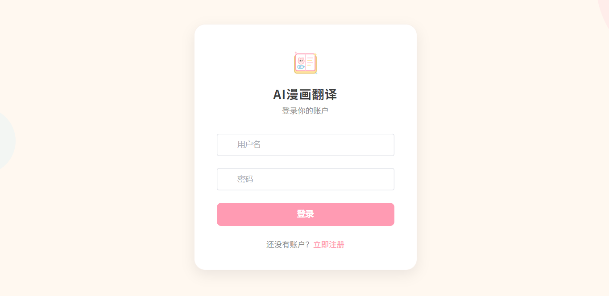
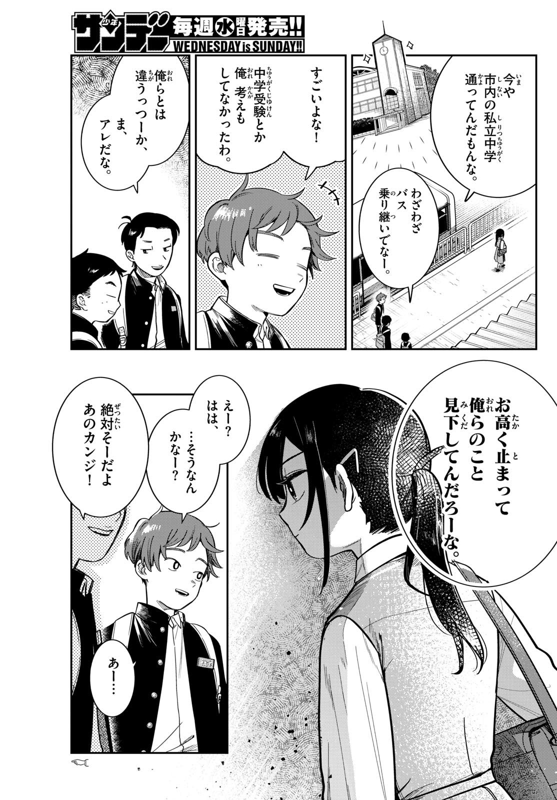
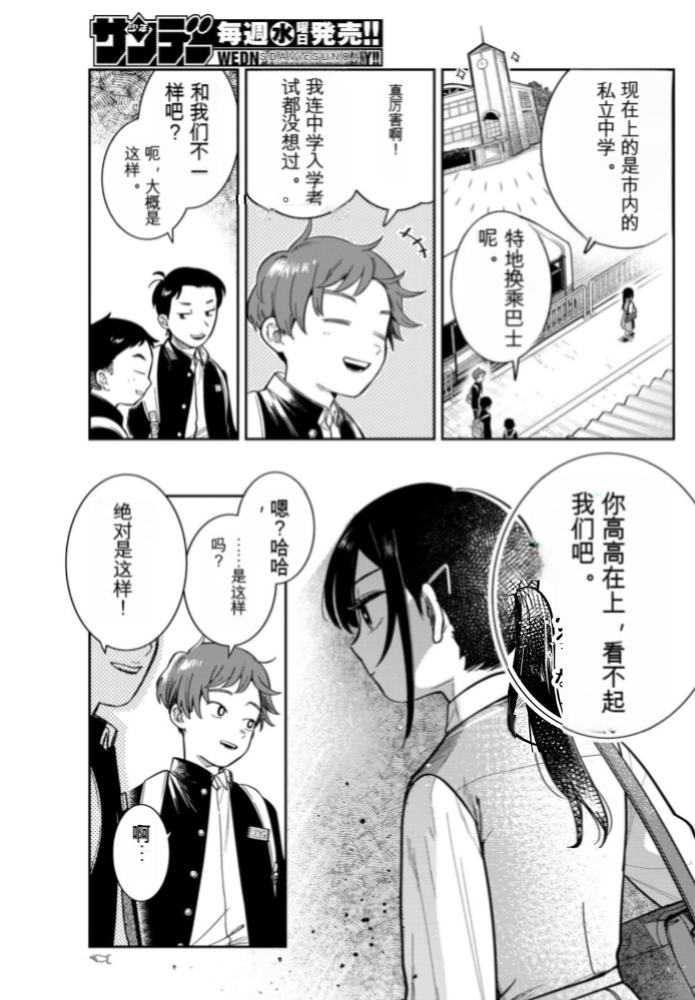

# Manga Translate — 漫画翻译平台

一个集成了 OCR、文本检测、图像修复、AI 翻译和渲染的全流程漫画翻译系统。

## 效果预览

### 登录界面


### 翻译效果
| 原图 | 译图 |
|:---:|:---:|
|  |  |

## 项目结构

```
manga-translate/
├── back/                          # Java 后端 (Spring Boot 4.0.3)
├── front/                         # Vue 3 前端 (TypeScript + Vite)
└── manga-image-translator-main/   # Python 算法服务 (FastAPI)
```

## 技术栈

### 后端 (back/)

| 技术 | 版本 | 用途 |
|------|------|------|
| Spring Boot | 4.0.3 | Web 框架 |
| MyBatis-Plus | 3.5.15 | ORM |
| PostgreSQL | - | 数据库 |
| Flyway | - | 数据库迁移 |
| RabbitMQ | - | 异步任务队列 |
| Spring AI | 2.0.0-M2 | LLM API 集成 (OpenAI 兼容) |
| 腾讯翻译 SDK | 3.1.922 | 腾讯云机器翻译 |
| JWT (jjwt) | 0.12.6 | 用户认证 |

### 前端 (front/)

| 技术 | 用途 |
|------|------|
| Vue 3 + TypeScript | 框架 |
| Vite | 构建工具 |
| Pinia | 状态管理 |
| Vue Router | 路由 |
| Element Plus | UI 组件库 |
| Fabric.js | 图片编辑器 Canvas |
| Axios | HTTP 客户端 |

### 算法端 (manga-image-translator-main/)

| 技术 | 用途 |
|------|------|
| FastAPI | Web 服务 |
| CTD (Comic Text Detector) | 文本检测 (默认) |
| LaMa MPE | 图像修复 (默认) |
| 48px OCR | 文字识别 |
| 自定义渲染器 | 文字渲染到图片 |

## 核心功能

### 漫画管理
- 支持 ZIP/RAR/CBZ/CBR 压缩包导入，自动解析章节结构
- 章节粒度管理：新建、重命名、删除、排序
- 封面自动生成，缩略图预览

### 翻译流程

系统支持两条翻译管线，根据翻译配置自动路由：

**Python 全流程管线**（默认兜底）
> 检测 → OCR → 翻译 → 修复 → 渲染，全部在 Python 算法端完成

**LLM 翻译管线**（配置了 llmConfigId 时启用）
> 1. Java 后端调用 Python 端进行 OCR + 图像修复
> 2. Java 后端调用 LLM 进行翻译（支持多模态图片输入）
> 3. Java 后端调用 Python 端 `/render-translated` 渲染译文

### 支持的翻译模型

| 类型 | 提供商 | 说明 |
|------|--------|------|
| 系统预设 | Ollama | qwen3, qwen3_big, qwen3.5-9b (多模态) |
| 自定义 | OpenAI / SiliconFlow / DeepSeek / Gemini | 用户自行配置 API Key |
| 机器翻译 | 腾讯云 TMT | 高速文本翻译 |

### 检测与修复优化

- 默认检测器: **CTD** (Comic Text Detector) — 专为漫画文本优化
- 默认修复器: **LaMa MPE** — MPE 增强版，修复质量更高
- 默认检测尺寸: **1536** — 更精细的文本检测
- **Precise Mask 模式**: 使用检测器原始逐像素掩膜裁切到文本框内直接修复，跳过 mask_refinement，保留检测器的像素级精度

### 图片编辑器
- 矩形/椭圆区域框选
- 区域级 OCR 识别
- 区域级/全局抠字（图像修复）
- AI 多模态翻译（选择 LLM 配置）
- 文字排版编辑（字体、大小、颜色、方向）
- 撤销/重做
- 一键保存为译图

### 阅读器
- 翻页/滚动两种阅读模式
- 原图/译图切换
- 章节导航

## 数据库迁移

使用 Flyway 进行数据库版本管理，运行后端时自动执行。

| 版本 | 文件 | 内容 |
|------|------|------|
| V1 | `V1__init_schema.sql` | 完整 schema: users, mangas, chapters, manga_pages, translate_configs, llm_configs, translation_records, translation_tasks |

首次运行后端 (`mvn spring-boot:run`) 时，Flyway 会自动执行数据库初始化。

## 消息队列

| 队列 | 路由键 | 用途 |
|------|--------|------|
| manga.translate.queue | manga.translate | Python 全流程翻译任务 |
| manga.translate.hq.queue | manga.translate.hq | LLM 翻译任务 |

## API 端点概览

### 漫画管理
- `GET /api/mangas` — 漫画列表
- `POST /api/mangas/upload-archive` — 导入压缩包
- `GET /api/mangas/{id}` — 漫画详情
- `GET /api/mangas/page-by-id/{pageId}/image` — 页面原图 (公开)
- `GET /api/mangas/page-by-id/{pageId}/thumbnail` — 页面缩略图 (公开)
- `GET /api/mangas/page-by-id/{pageId}/translated-image` — 页面译图 (公开)

### 章节管理
- `GET /api/mangas/{mangaId}/chapters` — 章节列表
- `GET /api/mangas/{mangaId}/chapters/all-pages` — 所有章节的全部页面 (单次批量查询)
- `POST /api/mangas/{mangaId}/chapters` — 创建章节
- `GET /api/mangas/{mangaId}/chapters/{id}/pages` — 章节页面列表

### 翻译
- `POST /api/translate/page` — 单页翻译
- `POST /api/translate/batch` — 批量翻译
- `GET /api/translate/records` — 翻译记录

### 配置管理
- `GET/POST/PUT/DELETE /api/configs` — 翻译配置 CRUD
- `GET/POST/PUT/DELETE /api/llm-configs` — LLM 模型配置 CRUD

### 图片编辑
- `POST /api/edit/inpaint` — 区域抠字
- `POST /api/edit/inpaint-all` — 全局抠字
- `POST /api/edit/ocr-region` — 区域 OCR
- `POST /api/edit/ai-translate` — AI 翻译 (基于 llmConfigId)
- `POST /api/edit/save` — 保存编辑结果

### Python 算法端
- `POST /translate/with-form/image/stream/web` — 流式翻译 (Web 前端专用)
- `POST /render-translated` — 渲染译文到修复图
- `POST /ocr` — OCR 识别
- `POST /inpaint` — 图像修复

## 快速开始

### 1. 启动 PostgreSQL 和 RabbitMQ

### 2. 启动算法端

> **注意:** 模型文件需单独下载，请参考 [manga-image-translator 官方说明](https://github.com/zyddnys/manga-image-translator#option-and-configuration)。

```bash
cd manga-image-translator-main
# 下载模型文件（请参考官方 README）
python -m server.main --host 0.0.0.0 --port 5003
```

### 3. 启动后端
```bash
cd back
mvn spring-boot:run
```

### 4. 启动前端
```bash
cd front
npm install
npm run dev
```

## 致谢

本项目的**图像修复（Inpainting）与渲染（Renderer）模块**基于 [manga-image-translator](https://github.com/zyddnys/manga-image-translator) 魔改而来，感谢原作者的开源贡献。

---

### 5. (可选) 启动 Ollama
```bash
ollama serve  # 默认端口 11434
ollama pull qwen3
```

## 配置说明

> **重要:** 请复制 `back/src/main/resources/application-local.yml.template`（如有）或直接修改以下占位符为实际值：
> - `YOUR_DB_PASSWORD` — PostgreSQL 密码
> - `YOUR_RABBITMQ_USER` / `YOUR_RABBITMQ_PASSWORD` — RabbitMQ 凭据
> - `YOUR_JWT_SECRET` — JWT 签名密钥
> - `YOUR_PYTHON_SERVICE_URL` — Python 算法端地址
> - `YOUR_OLLAMA_SERVICE_URL` — Ollama 服务地址（可选）

### application.yml 关键配置

```yaml
app:
  translator:
    api-base: http://localhost:5003      # Python 算法端地址
  ollama:
    base-url: http://localhost:11434/v1  # Ollama 服务地址

spring:
  ai:
    openai:
      enabled: false  # 禁用 Spring AI 自动配置，ChatModel 由 ChatModelFactory 动态创建
```
